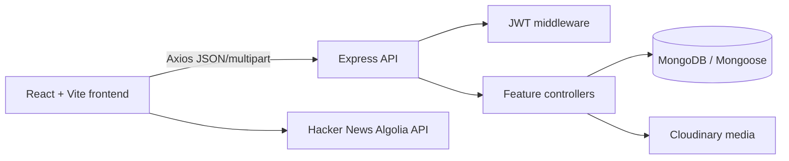
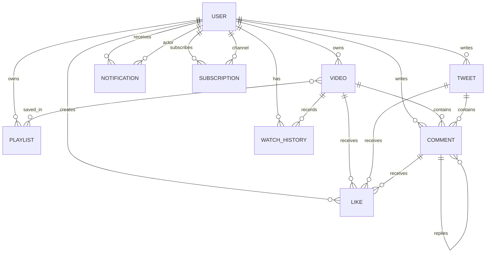

# MYTUBE Architecture and Schema Relationships

## Runtime architecture

`frontend/src/main.tsx` mounts React, routing, theme state, and Sonner. `App.tsx` defines public, guest, protected, watch, channel, playlist, dashboard, settings, history, and post routes. `AppShell.tsx` provides navigation and the shared application frame.

The frontend calls `/api/v1` through `frontend/src/api/axios.ts`. The client attaches the stored access token, retries one expired request through refresh-token, and redirects protected pages to login when refresh fails.

`backend/src/app.js` mounts the feature routers under `/api/v1`. `backend/src/index.js` loads `.env`, connects MongoDB, and starts Express. Controllers validate input, apply authorization, call models/services, and return `ApiResponse` values.

## Feature flow

- Videos: upload multipart files, extract duration, upload to Cloudinary, create `Video`, optionally add it to owner `Playlist` documents, and notify subscribers.
- Playback: `GET /videos/:videoId` reads metadata; `POST /videos/view/:videoId` records a view separately; the frontend guards the view request per video route.
- Social reactions: `Like` stores one user reaction for a video, tweet, or comment. Video/tweet reactions support `like` and `unlike`; `likeStats.js` calculates counts and current-user state.
- Comments: `Comment` references either a video or tweet and optionally a parent comment. Comment creation can create owner/reply notifications.
- Playlists: `Playlist.videos` references `Video` IDs. Add/remove operations use `$addToSet` and `$pull`; video deletion pulls deleted IDs from every playlist.
- History: `WatchHistory` references a user and video with `watchedAt`. Deleted videos are removed and populated null values are filtered.
- Notifications: `Notification` stores recipient, actor, event type, message, optional content reference, and read state. The frontend polls the authenticated notification endpoint.

## Schema relationships

## Deletion rules

Video deletion removes the video, playlist references, video likes, likes on its comments, watch-history records, and comments. Tweet deletion removes the tweet, tweet likes, comment likes, and tweet comments. Frontend lists filter missing populated references and render empty states instead of dereferencing deleted objects.
